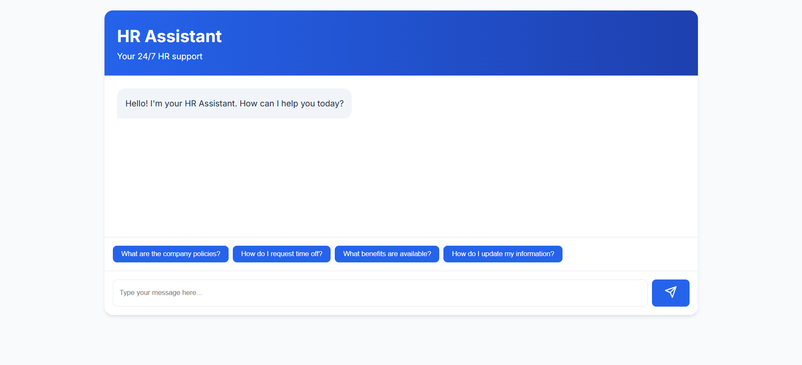
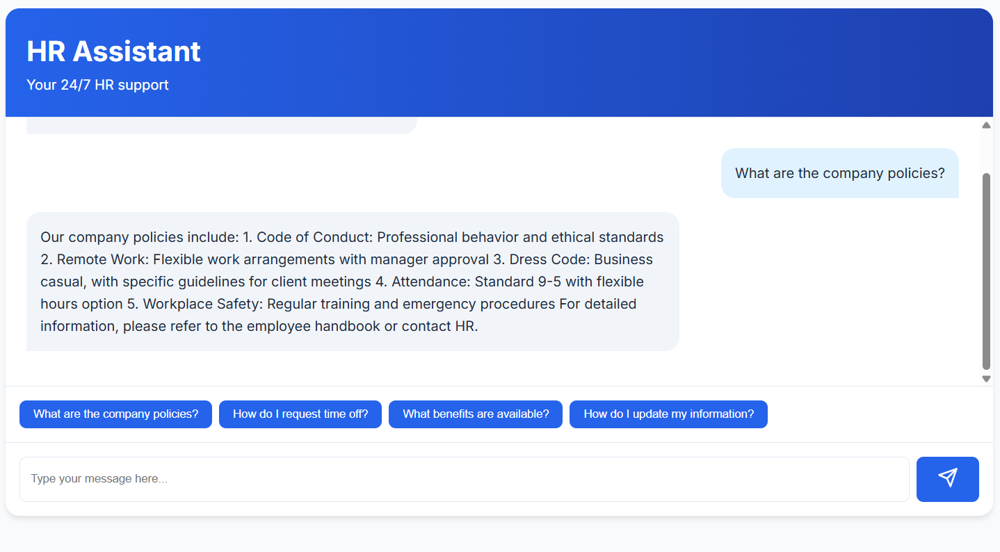

# 🤖 HR Assistant: Your AI-Powered HR Companion

Welcome to HR Assistant, where cutting-edge AI meets human resources management. This innovative chatbot solution revolutionizes how employees interact with HR services, providing instant, accurate, and professional responses to all your HR-related queries.

## 🌟 What Makes HR Assistant Special?

### Instant Support, Anytime
- Get immediate answers to your HR questions
- 24/7 availability without waiting for office hours
- Professional and accurate responses every time

### Comprehensive HR Knowledge
Our AI assistant is well-versed in:
- Company policies and procedures
- Time off and leave management
- Employee benefits and compensation
- Career development opportunities
- Workplace guidelines and safety

### User-Friendly Interface
- Clean, modern design
- Intuitive chat experience
- Quick reply options for common queries
- Smooth animations and transitions
- Mobile-responsive layout

## 📸 Application Screenshots

<div align="center">
    
    <p><em>Modern chat interface with quick reply options</em></p>
    
    
    <p><em>Professional responses with detailed information</em></p>
</div>

## 🚀 Quick Start Guide

### System Requirements
- Python 3.8 or newer
- Node.js 14 or above
- Modern web browser

### Installation Steps

1. **Get the Code**
   ```bash
   git clone https://github.com/yourusername/hr-assistant.git
   cd hr-assistant
   ```

2. **Set Up the Environment**
   ```bash
   # Install Python packages
   pip install -r requirements.txt
   
   # Install frontend dependencies
   npm install
   ```

3. **Launch the Application**
   ```bash
   # Start the backend server
   python app.py
   ```

4. **Access the Chatbot**
   Open your browser and visit:
   ```
   http://localhost:5000
   ```

## 🏗️ Behind the Scenes

### Project Architecture
```
hr-assistant/
├── app.py                  # Backend server
├── requirements.txt        # Python dependencies
├── package.json           # Frontend dependencies
├── templates/             # HTML templates
│   └── index.html         # Main interface
├── static/                # Static files
│   ├── css/              # Styling
│   ├── js/               # Frontend logic
│   └── images/           # Media assets
└── README.md             # Documentation
```

### Technology Stack

#### Backend
- **Python**: Core programming language
- **Flask**: Lightweight web framework
- **GPT-2**: Advanced language model
- **Transformers**: NLP processing

#### Frontend
- **React.js**: UI framework
- **Material-UI**: Component library
- **Framer Motion**: Smooth animations
- **Axios**: HTTP client

## 💡 Key Features

### Smart Response Generation
- Context-aware answers
- Professional tone
- Step-by-step instructions
- Policy references
- Empathetic communication

### User Experience
- Real-time chat interface
- Typing indicators
- Message history
- Error handling
- Loading states


 
